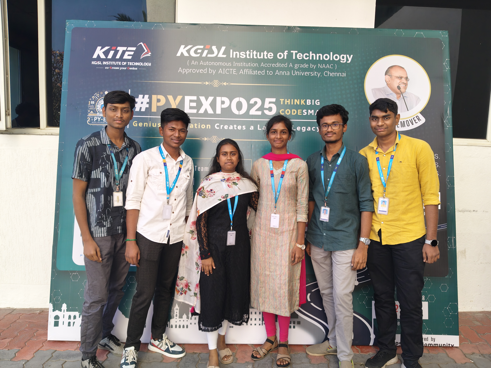
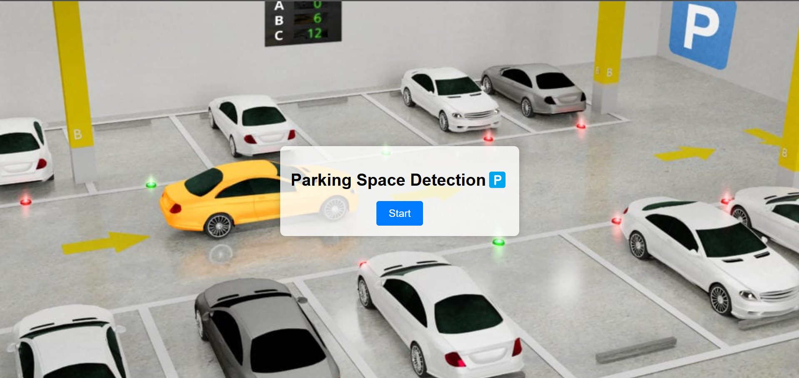
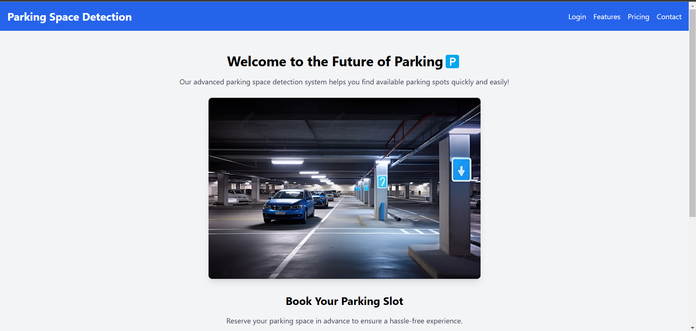

---

## Problem Statement

*Problem Statement ID – PY040*

Parking Space Detection System

---

## Overview

Detects the parking space in real time. User friendly application shows real time parking availability. Parking guidance system that directs to available parking slots (Route Map) . Convenient access to parking information for user. Less time spent searching for parking can alleviate (Reduce) traffic congestion. Allows user to pay for parking directly through the application.

---

## Team Members

*Team ID – T024*

- *Balasubramaniyan S*-Team Leader,Backend
- *Anbu V*-Backend
- *Janani J*- Frontend
- *Johan Manova*- Open CV, YOLOv8
- *Karthikeyan S N* - Open CV, YOLOv8
- *Marooshini S*- Frontend

---

## Technical Stack

- *Frontend:* HTML, CSS, JavaScript
- *Backend:* Flask
- *Database:* MySQL
- *Other Tools:* Open CV,YOLOv8

---

## UI Overview

Images to demonstrate the user interface:

*Example pages:*

1. *Landing Page:*
   

2. *Dashboard:*
   

3. *Analytics View:*
   

---

## Resources

### 📄 PowerPoint Presentation
[Click here to view the PPT](https://drive.google.com/file/d/17VDWMsuR9bGwOe1hPa3hVmDZiCe2Sl58/view?usp=drive_link)

### 🎥 Project Video
[Click here to view the project demo video](https://drive.google.com/file/d/1HDsmwK_ipdTLs-BzUuarm0_Y5JWx6DqE/view?usp=drive_link)

### 📹 YouTube Link
[Watch the project on YouTube](https://youtube.com/shorts/awCR8rzRaRU?si=0mIGHm2oBkV4e8TU)

---